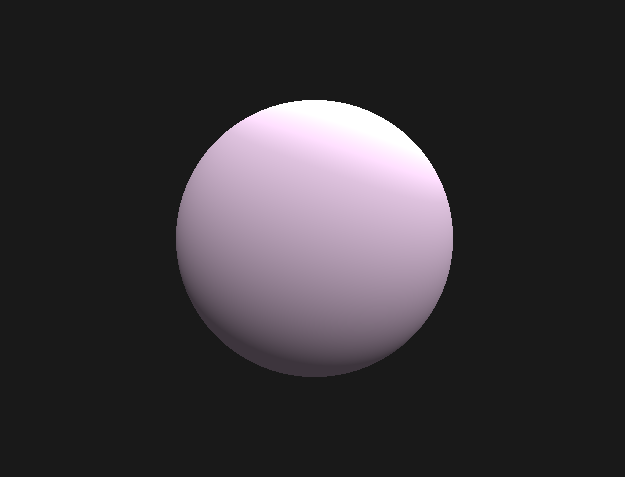
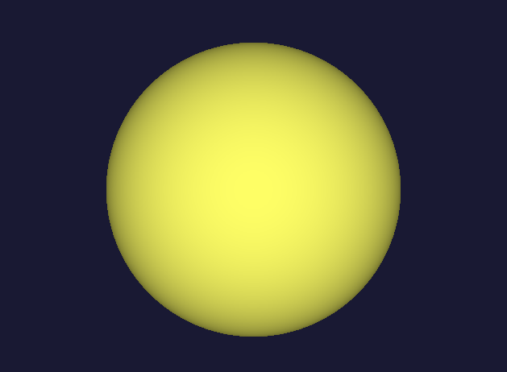

# Ray Tracer

Primitive ray tracer developed as a first year university project. Delves into how a 
ray tracers work coincide with a camera, as well as my first introduction to the common matrix 
mathematics present in 3D applications (like video games) - for example: camera and world space 
conversion matricies. 

Submitted as an assignment project at Bournemouth University (2021).  

# Current Video Explanation
[Mathematics for Computer Graphics Assignment Video Demo](https://youtu.be/hklSOnDjiXQ)  
